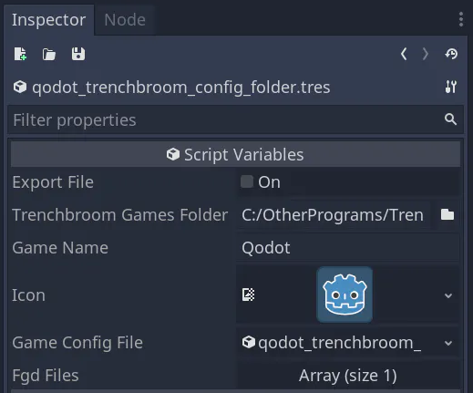
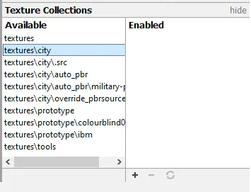
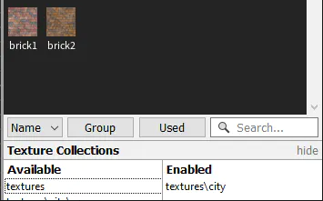

# Applying Textures

While you can follow the steps shown in [Building Maps](building-maps.md) without additional setup, most maps will be missing textures when built.

If your .map file has textures applied to the geometric brushes, Qodot can automate the process of applying those textures to your map geometry in Godot.

1. TOC
{:toc}

## Overview

The pipeline to take a texture from "Godot project" to "on QodotMap geometry" is:

1. Create a Trenchbroom game config (.cfg) that uses your Godot project directory as its *Game Path* in Preferences.
1. Add an image to your Godot project directory, in a folder called `/textures/subfolder`.
1. Refresh Trenchbroom texture collections by pressing <kbd>F5</kbd>.
1. Enable new texture collections in Trenchbroom using the Texture tab.
1. Select the brush you want to texture and click the texture to paint it.
1. Click Full Build on a QodotMap to view the texture in Godot.

The rest of this page will go through each of these steps.

Warning
{: .label .label-red }
Don't add new files to the `res://addons/qodot` folder or any of its subfolders. Anything added here will be overwritten or erased if you update Qodot. However, you are free to use and copy files in `res://addons/qodot` as shown later on this page.

## Creating a Textures folder

Trenchbroom reads your Godot project's textures by looking for a folder called `/textures` on the top level of your Godot project, then looking for a subfolder that groups these textures. The subfolder can be called anything. One example of this is `res://textures/group_name`, where `/group_name` can be any name to group textures with.

## Making a Trenchbroom game config

A Trenchbroom game configuration (stored as a .cfg file) tells Trenchbroom about the name of your game, and where your game's project directory is.

When you install Qodot, you get a resource tool to create your own Trenchbroom config file. When you **double click** the .tres file, you get a menu in the Inspector.

This lets you create a unique the details for a .cfg for your Godot project.

When it's ready, you can click *Config Folder -> Export* and Qodot will automatically create the .cfg, as well as appropriate subfolders and accompanying files in your Trenchbroom `/games` directory.

Use the FileSystem dock to search for the `Qodot_Trenchbroom_Config_Folder.tres` file. It is installed at  `res://addons/qodot/game_definitions/trenchbroom/`. You can ignore `Qodot_Trenchbroom_Config_File.tres`, it's the `_Folder` variant we want.

Note
{: .label .label-blue }
Your project needs an `icon.png` file, or else Qodot won't be able to generate a Trenchbroom game config. Godot will complain on this step until you re-add `res://icon.png` and restart Godot.

Open the `Config_Folder.tres` resource by double clicking on it in the FileSystem dock. This will give you a list of tools to edit the new .cfg inside of your Inspector.

Inside of _Trenchbroom Games Folder_, add the directory path to the `/games` folder inside your Trenchbroom installation. Depending on your OS this is located in different folders:

| Platform | Location |
| -------- | ---------|
| Windows | The directory where the TrenchBroom executable is located, such as C:\Users\<username>\Documents\Trenchbroom\games\ |
| macOS | TrenchBroom.app/Contents/Resources |
| Linux | <prefix>/share/trenchbroom, where <prefix> is the installation prefix. |

If you don't have write access to the folder, you can also use the UserData folder for your OS:

| Platform | Location |
| -------- | ---------|
| Windows | C:\Users\<username>\AppData\Roaming\TrenchBroom|
| macOS | ~/Library/Application Support/TrenchBroom |
| Linux | ~/.TrenchBroom |

Back to editing the .cfg, you should change the _Game Name_ to your project’s name to avoid overwriting other Godot project names in the future.

Finally, click the _Export File_ checkbox at the top. Your game config should now be in Trenchbroom! You can go and see if Trenchbroom has your game listed in the games list when creating a new map.

The next two steps will ensure Trenchbroom can read your project's textures, and so Qodot can correctly read those textures and apply it to geometry in Godot.

## Setting Trenchbroom Game Path

Once you've got a config file, Trenchbroom is ready for you to manually set the *Game Path* property in its Preferences menu. Once set, Trenchbroom will be able to read any images inside your Godot project’s `res://textures/group_name/` folder.

Launch Trenchbroom, click "New Map..." and select your game's name and icon from the Select Game list.

Once it's selected, click "Open preferences..." and find your game in the preferences list. In this example, I called my game QodotTemplate. Yours will be different depending on the _Game Name_ you set earlier in `Qodot_Trenchbroom_Config_Folder.tres`.

Under "Game Path", click the ellipsis "..." and select your Godot project folder from your file system. Click Apply.

You can now create a new map with your Godot project as the game type.

Note
{: .label .label-blue }
If you're having trouble clicking the apply button on the window, temporarily increase your screen's resolution. Not clicking apply here can cause issues later on when reloading Trenchbroom.

## Enabling Trenchbroom Texture Collections

You can only enable a texture collection if your project has the following conditions:
- You have your Godot project's .cfg in Trenchbroom's `/games` folder.
- Your game path is set in Trenchbroom preferences.
- There's a top-level folder inside your Godot project called `/textures`.
- There's a subfolder inside of `/textures`, such as `/group_name` or `/forest`.
- There's image files inside of the `/group_name` subfolder.

Once all of these conditions are satisfied, press F5 to refresh the texture collections in Trenchbroom.

In Trenchbroom, navigate to the "Face" tab in the top right, and unfold the "Texture Collections" menu at the bottom.

Click the name of a folder you want to enable.

Click "+" at the bottom-right to enable it, moving it to the "enabled" collection.

# The Next Step

Congratulations! You've completed the Beginner's Guide to Qodot. From having completed this guide, you should be able to build maps in Qodot and unify textures between Trenchbroom and your Godot project.

Here are some common next steps for developers:

| Next step | Link |
| :------------------------------------------------------------------ | :------------------------- |
| Apply materials and shaders to brushes: | [Textures](../materials.md) |
| Place Godot scenes using Trenchbroom: | [Entities](../entities.md) |
| Prepare a project for scaling up: | [Best Practices](../best-practices.md) |
