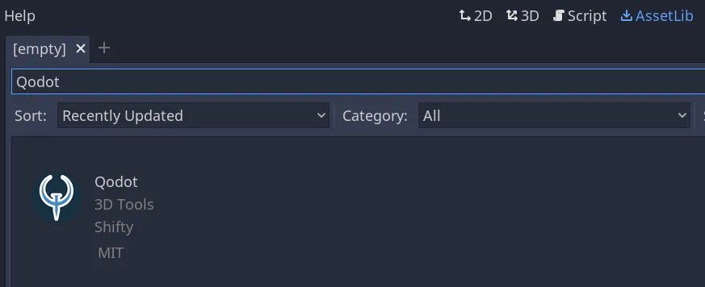
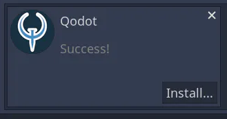
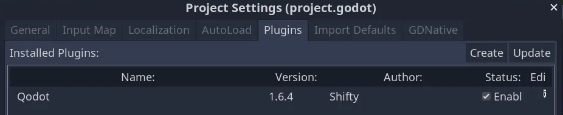

# Installation

To install Qodot, Create a new Godot project, or load an existing one.

Go to the AssetLib tab and search for “Qodot”.

Once you click “Qodot” and click download, wait for it to finish downloading, then click "Install":

A tree of items to be installed will show up. Click "Install" at the bottom of the window.

**Note:** Godot 3.x can hang during the import process, but this is not a crash. It will finish importing if you wait long enough. You can speed this process up by moving `/addons/qodot` out of your project, set Project -> Project Settings -> Import -> Import Etc2 to false, and move it back in. You can also delete `/addons/qodot/textures` if you don't plan on copying the example textures to your own `/textures` folder.

When the importer is done, go to Project → Project Settings -> Plugins. By default, Qodot is not enabled. Click the checkbox next to its name to enable it:

## Updating

When updating, make sure to delete `/addons/qodot` from your project before installing a newer version, in order to avoid script errors arising from mis-matched code.

## Compatibility

Here is the compatibility for Qodot across different Godot versions.

- Godot 3.1.x+
    - Qodot 1.0
    - Qodot 1.5.6
- Godot 3.2.x+
    - Qodot 1.6.0+
- Godot 3.3.x+
    - Qodot 1.7.0+

Read [Building Maps](building-maps.md) to get started with Qodot!
